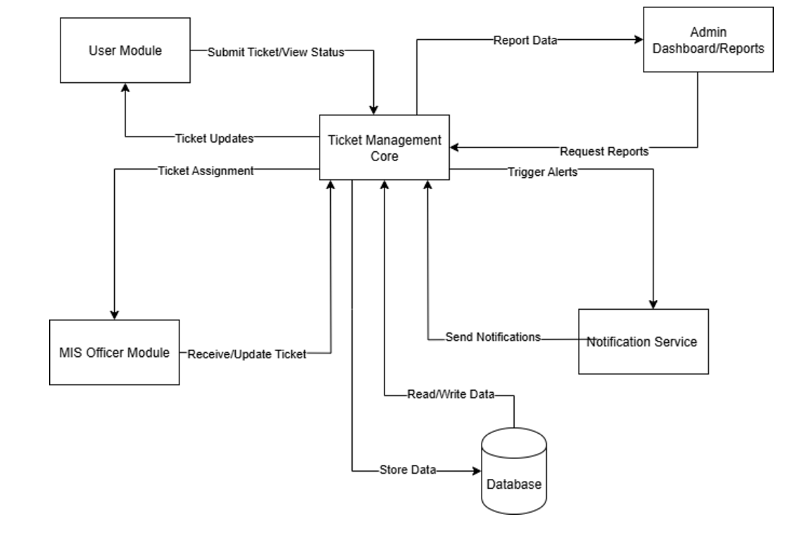

OBJECTIVES AND SCOPE:
 1) Provide a centralized platform for university departments to report technical
issues such as internet connectivity, hardware malfunctions, and system errors.
2) Implement a First-In, First-Out (FIFO) system to process and resolve tickets in
the order they are received, ensuring fairness and organized workflow. 
3) Allow the MIS office to track, prioritize, and respond to issues promptly, reducing
downtime and ensuring accountability in service delivery. 
4) Enable real-time updates and notifications so departments are informed about
the status of their reported concerns from submission to resolution. 
5) Minimize disruptions in administrative and academic functions by resolving
technical problems quickly, ensuring continuity of services across departments.
6) Record and analyze support requests to identify recurring issues, allocate
resources effectively, and improve long-term IT infrastructure planning. 
7) Provide an easy-to-use mobile and/or web platform where staff and faculty can
conveniently report issues anytime without the need for manual forms or follow-ups.

STAKEHOLDERS: MIS OFFICE and MinSU CLINIC

TOOLS/TECHNOLOGIES: Laravel, Laragon, PHP

## Integration Pattern Applied
The TeamKasalo system uses thHub-Spoke integration pattern.

### Rationale
All system communications are centralized in the Ticket Management Core (Hub). This reduces interdependencies between modules, making the system easier to scale and maintain. The hub ensures consistent workflows for ticket reporting, resolution, and user notifications.

### Diagram Reference

